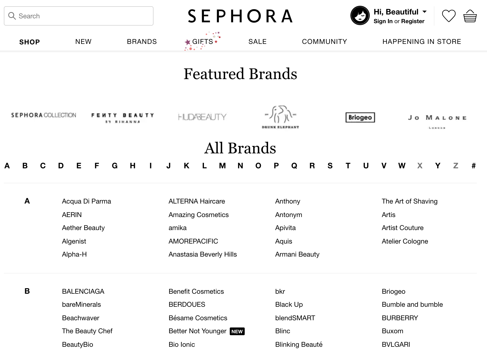
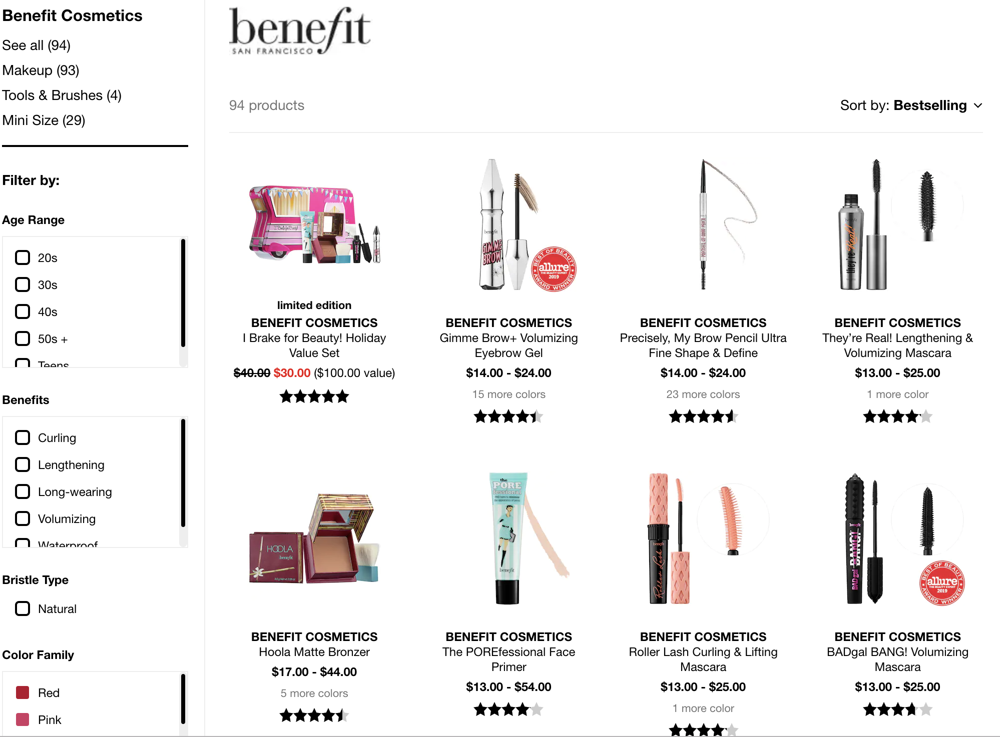
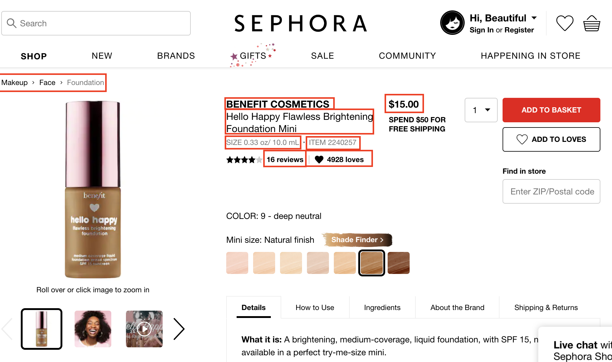
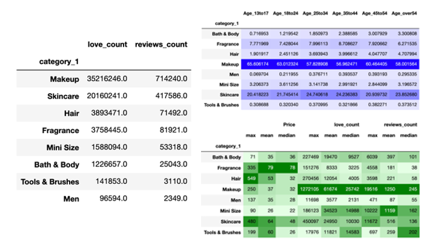
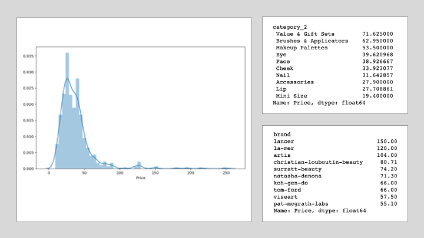
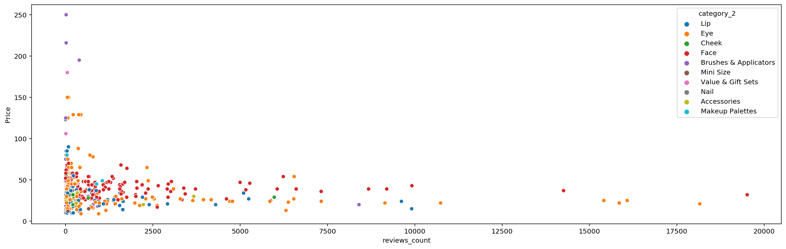
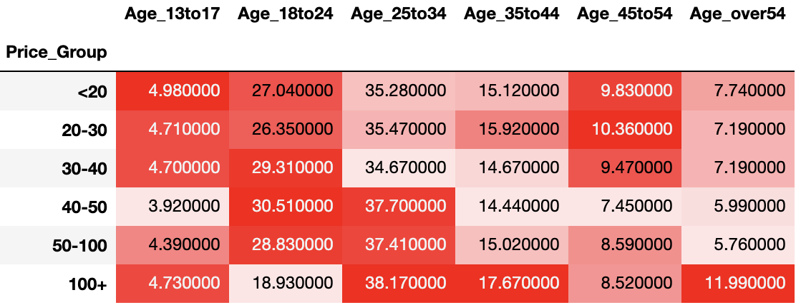
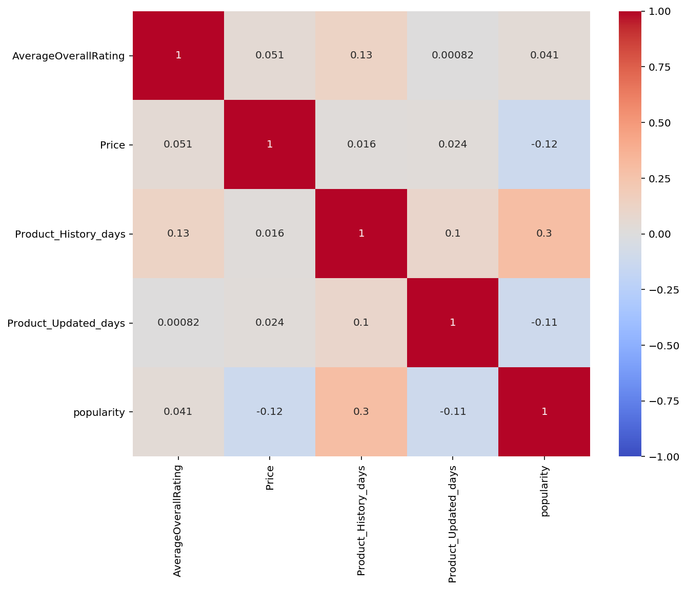

# Sephora Product Analysis
  - Start date: 02/2019
  - FE 290 - Data and Programming for Analytics @ UCI
  - Author: Shirley Li


Table of Contents
---
   * [About the project](#about-the-project)
   * [Scraping data from Sephora](#scraping-data-from-sephora)
      * [Step 1: Get all the brand links and product links](#step-1-get-all-the-brand-links-and-product-links)
         * [a) From Sephora's Brand list website, we can scrape all the brand links.](#a-from-sephoras-brand-list-website-we-can-scrape-all-the-brand-links)
         * [b) After clicking each brand link, we can see all the product page and scrape all the product links.](#b-after-clicking-each-brand-link-we-can-see-all-the-product-page-and-scrape-all-the-product-links)
      * [Step 2: Get product information](#step-2-get-product-information)
      * [Step 3: Get reviews data](#step-3-get-reviews-data)
   * [Visualizations and Analysis for Sephora products](#visualizations-and-analysis-for-sephora-products)
      * [Problems to answer](#problems-to-answer)
      * [1. What categories have the largest market?](#1-what-categories-have-the-largest-market)
      * [2. For the category with the largest market, how to price the product?](#2-For-the-category-with-the-largest-market-how-to-price-the-product)
      * [3. Assume we are going to sell a product on Sephora, how to predict its popularity?](#3-Assume-we-are-going-to-sell-a-product-on-Sephora-how-to-predict-its-popularity)
   * [Recommendation System](#recommendation-system)
      * [Content-based Recommendation](#content-based-recommendation-code)
      * [Collaborative Filtering Recommendation](#collaborative-filtering-recommendation-code)


## About the project
This project is originally for the class FE290 during my accounting master study at UCI. After my study of data science at USF, I decided to apply what I have learned from the MSDS program and optimize this project. So this project will keep updating from time to time. Currently what I have completed is:
 - 1. Built a scraper to get the product info and reviews from Sephora
 - 2. Product data Analysis
 - 3. Built recommendation systems based on product info and reviews data.

## Scraping data from Sephora
Here are some steps to scape the product information as well as review data.

### Step 1: Get all the brand links and product links

#### a) From Sephora's Brand list website, we can scrape all the brand links. [[Code]](https://github.com/Shirleyiscool/Scraping-Sephora/blob/master/scraper/scrape_brand_links.py)
```
python scraper/scrape_brand_links.py
```
This will automatically help save all the brand links into a text file as `data/brand_link.txt`




#### b) After clicking each brand link, we can see all the product page and scrape all the product links. [[Code]](https://github.com/Shirleyiscool/Scraping-Sephora/blob/master/scraper/scrape_product_links.py)
```
python scraper/scrape_product_links.py
```
This will automatically help save all the product links into a text file as `data/product_links.txt`




**Note**: To show all the product links, the brand link must add `/all?pageSize=300` at the end for scraping.

### Step 2: Get product information [[Code]](https://github.com/Shirleyiscool/Scraping-Sephora/blob/master/scraper/scrape_product_info.py)
From the product page, we can decide what information we are going to scrape.


Here, we are going to scrape information including product name, product ID, category, brand, price, size, love count, review count, rating.

```
python scraper/scrape_product_info.py
```
This will automatically help save all the product info into a csv file as `data/pd_info.csv`

**Note**: You may need to replace the proxies to scrape data.

If we wish to scrape all the product information, we have to request Sephora for over 3000 times, which lead to the risk of being blocked.

To prevent being blocked by Sephora, there are two ways that we can do.

1) Use different **VPNs** and try to scrape about 1500 links for each time.

2) Use different **proxies** to request.

We here use the second way. But it is hard to find good proxies online. So far, I cannot find an easy way to automatically scrape workable proxies, but have to copy and paste some workable proxies by hand found [online](http://www.freeproxylists.net/zh/?c=US&pr=HTTPS&u=80&s=ts).

### Step 3: Get reviews data [[Code]](https://github.com/Shirleyiscool/Scraping-Sephora/blob/master/scraper/scrape_reviews.py)

We use the API to get the review data and refer to this [article](https://kiwidamien.github.io/using-api-calls-via-the-network-panel.html).

```
python scraper/scrape_reviews.py
```
Again we use proxies to scrape the data. And we will get a json file as `data/scraper_result.json` when it is done.

And we then parse this json file using the codes [here](https://github.com/Shirleyiscool/Scraping-Sephora/blob/master/scraper/parse_reviews.py)
```
python scraper/parse_reviews.py
```
This will automatically help save all the review data into a csv file as `data/review_data.csv` and update the product info file as `data/product_data.csv`.


## Visualizations and Analysis for Sephora products

After cleaning data [(product data](https://github.com/Shirleyiscool/Scraping-Sephora/blob/master/nb_clean_data/clean_product_data.ipynb) and [review data)](https://github.com/Shirleyiscool/Scraping-Sephora/blob/master/nb_clean_data/clean_review_data.ipynb), we did some analysis with this [notebook](https://github.com/Shirleyiscool/Scraping-Sephora/blob/master/data_analysis_ML/Products_DataAnalysis_ML.ipynb).

**Note**: The analysis below is based on the product info at a certain time. It can reflect a trend, but some details may differ from the information you get at current time, as Sephora's products on self change every day.

### Problems to answer

Assuming we are a Makeup/Skincare companies, we hope to invest on a new product sold on Sephora. So here are some problems that need to be answered.

- 1. What categories have the largest market?
- 2. For the category with the largest market, how to price the product?
- 3. Assume we are going to sell a product on Sephora, how to predict its popularity?


### 1. What categories have the largest market?


In general, Makeup and Skincare are the two largest categories for Sephora, from either the love counts and review counts. Makeup products are welcomed by all age group and its average love counts and review counts are much higher than other categories. It means makeup products are very popular on Sephora.

Besides, the mean price for makeup products is low, meaning it may be easier for a
startup company to begin with limited budget for developing product.

### 2. For the category with the largest market, how to price the product?

**Price Distribution**


From the distribution, we can find that price for Makeup products are mainly priced between $20 and $50. While "Value & Gift Sets" contains more products in a set and is priced higher on average, Lips are usually much cheaper and accessible.

Brands can also add value. The most expensive brand on average can be $100 more than the 10th brand.

**Price & Love Counts**

**Price & Review Counts**


If you hope your makeup products will be very popular, you must not make it expensive. From the graphs above, it shows people generally love the products priced less than $50.

**Price Group & Age Group**


For each column (Age group), The deeper color means larger percentage of people to buy products at this price group. The sum of each row is 100. Therefore the value for the table below means for each price group, how much percentage of the population is that age group.

For example, the final value: "11.99" means For the population who buy Makeup Products at $100+, 11.99% is those aged over 54.

Therefore, from the table above, we can find that the population aged over 25 tends to buy more expensive products, while younger age is not sensitive with the price. But note that the largest population group is 18-24 and 25-34. If a startup company wish to develop a product, the company need to know the target customers. The product should be priced lower if the target customers are aged less than 25 and priced higher for customers aged 25+.

### 3. Assume we are going to sell a product on Sephora, how to predict its popularity?

We here use `love_count + reviews_count = popularity` as the metric to evaluate the popularity of a product.

Besides, `Product_History_days` means how long it has been since the product started to sell at Sephora. `Product_Updated_days` means how long it has been since the product info was updated at Sephora.



From the graph here, we can notice that if a product has been sold for a long time, it tends to be more popular and receive more love and reviews. Besides, lower price is also related with higher popularity. The average rating seems has little positive relationship with the high popularity.

I also tried ML methods to predict popularity, but the best model - Random Forest only achieve 0.21 R-squared, which is caused by limited explained variables. And the model shows top 3 important features are `Product_Updated_days`, `Product_History_days` and `Price`.

More work may be done in the future to answer this problems better.  


## Recommendation System

### Content-based Recommendation [[Code]](https://github.com/Shirleyiscool/Scraping-Sephora/blob/master/nb_recommendation/Recom_CB.ipynb)

### Collaborative Filtering Recommendation [[Code]](https://github.com/Shirleyiscool/Scraping-Sephora/blob/master/nb_recommendation/Recom_CF_FastAI.ipynb)
